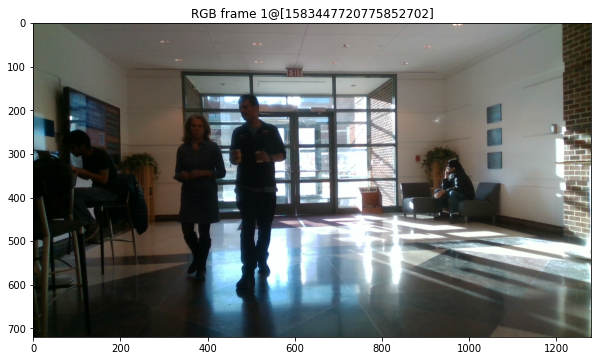

# RaDICaL Dataset SDK
> The RaDICaL Dataset: A synchronized and calibrated low-level Radar, RGB-D and IMU dataset.


[](https://www.youtube.com/watch?v=l0AyUw59w7g)

This is pre-alpha research quality code, and is being actively developed on.
Anything may change at anytime. Please check back here often.

Bug reports are very much appreciated.

# TODO

 - [x] Radar config reader
 - [x] Read from aligned H5 dataset
 - [ ] Read from raw bags (to produce aligned/unaligned H5 datasets)
 - [x] Polar to Cartesian Projection
 - [ ] Camera/Radar coordinate transforms

## Install

`python -m pip install git+https://github.com/moodoki/radical_sdk.git`

## How to use
> Dataset is currently under review and will be made available soon.

Download the dataset at our [project page](https://publish.illinois.edu/radicaldata/).
A small sample (50 frames) to try things our can be found [here](https://fireball.teckyianlim.me/file/flaming-cake/indoor_sample_50.h5). [md5sum: b195ff422cc4c979eeb81623899050cb]
> Dataset is distrbuted under [CC BY-SA 4.0](https://creativecommons.org/licenses/by-sa/4.0/) license.

Reading and displaying depth and RGB is easy

```python
#skip
import matplotlib.pyplot as plt
import numpy as np

plt.rcParams['figure.figsize'] = [10, 20]
```

```python
#skip
from radicalsdk.h5dataset import H5DatasetLoader

data = H5DatasetLoader('../samples/indoor_sample_50.h5')


frame_idx = 1
plt.figure()
plt.imshow(data['rgb'][frame_idx][..., ::-1])
plt.title(f'RGB frame {frame_idx}@{data["rgb_timestamp"][frame_idx]}')
plt.show()
plt.figure()
plt.imshow(data['depth'][frame_idx])
plt.title(f'Depth frame {frame_idx}@{data["depth_timestamp"][frame_idx]}')
plt.show()
```





The radar data is a 3D array arranged slow_time, antenna, fast_time.

`RadarFrame` encapsulates the necessary processing and saves computation on subsequent calls
as steps can be very expensive.

```python
#skip

from radicalsdk.radar.config_v1 import read_radar_params
from radicalsdk.radar.v1 import RadarFrame

# Read config and configure RadarFrame object
radar_config = read_radar_params('../samples/indoor_human_rcs.cfg')
rf = RadarFrame(radar_config)
```

### Range Azimuth in Polar Coordinates

```python
# skip
plt.figure()
plt.imshow(np.log(np.abs(rf.compute_range_azimuth(data['radar'][1]))))
plt.show()
```


### Projecting to cartesian

```python
#skip
from radicalsdk.geometry import PolarToCartesianWarp

p2c = PolarToCartesianWarp()

cartesian_radar = p2c(np.abs(rf.range_azimuth_capon)[np.newaxis, ..., np.newaxis])
plt.figure()
with np.errstate(divide='ignore'):
    plt.imshow(np.log(cartesian_radar[0, ...]))
plt.show()
```


    ---------------------------------------------------------------------------

    InternalError                             Traceback (most recent call last)

    <ipython-input-7-af2162eba268> in <module>
          4 p2c = PolarToCartesianWarp()
          5 
    ----> 6 cartesian_radar = p2c(np.abs(rf.range_azimuth_capon)[np.newaxis, ..., np.newaxis])
          7 plt.figure()
          8 with np.errstate(divide='ignore'):


    ~/.venvs/radical/lib/python3.8/site-packages/tensorflow/python/keras/engine/base_layer.py in __call__(self, *args, **kwargs)
        958     if any(isinstance(x, (
        959         np_arrays.ndarray, np.ndarray, float, int)) for x in input_list):
    --> 960       inputs = nest.map_structure(_convert_numpy_or_python_types, inputs)
        961       input_list = nest.flatten(inputs)
        962 


    ~/.venvs/radical/lib/python3.8/site-packages/tensorflow/python/util/nest.py in map_structure(func, *structure, **kwargs)
        657 
        658   return pack_sequence_as(
    --> 659       structure[0], [func(*x) for x in entries],
        660       expand_composites=expand_composites)
        661 


    ~/.venvs/radical/lib/python3.8/site-packages/tensorflow/python/util/nest.py in <listcomp>(.0)
        657 
        658   return pack_sequence_as(
    --> 659       structure[0], [func(*x) for x in entries],
        660       expand_composites=expand_composites)
        661 


    ~/.venvs/radical/lib/python3.8/site-packages/tensorflow/python/keras/engine/base_layer.py in _convert_numpy_or_python_types(x)
       3307 def _convert_numpy_or_python_types(x):
       3308   if isinstance(x, (np_arrays.ndarray, np.ndarray, float, int)):
    -> 3309     return ops.convert_to_tensor_v2_with_dispatch(x)
       3310   return x
       3311 


    ~/.venvs/radical/lib/python3.8/site-packages/tensorflow/python/util/dispatch.py in wrapper(*args, **kwargs)
        199     """Call target, and fall back on dispatchers if there is a TypeError."""
        200     try:
    --> 201       return target(*args, **kwargs)
        202     except (TypeError, ValueError):
        203       # Note: convert_to_eager_tensor currently raises a ValueError, not a


    ~/.venvs/radical/lib/python3.8/site-packages/tensorflow/python/framework/ops.py in convert_to_tensor_v2_with_dispatch(value, dtype, dtype_hint, name)
       1402     ValueError: If the `value` is a tensor not of given `dtype` in graph mode.
       1403   """
    -> 1404   return convert_to_tensor_v2(
       1405       value, dtype=dtype, dtype_hint=dtype_hint, name=name)
       1406 


    ~/.venvs/radical/lib/python3.8/site-packages/tensorflow/python/framework/ops.py in convert_to_tensor_v2(value, dtype, dtype_hint, name)
       1408 def convert_to_tensor_v2(value, dtype=None, dtype_hint=None, name=None):
       1409   """Converts the given `value` to a `Tensor`."""
    -> 1410   return convert_to_tensor(
       1411       value=value,
       1412       dtype=dtype,


    ~/.venvs/radical/lib/python3.8/site-packages/tensorflow/python/profiler/trace.py in wrapped(*args, **kwargs)
        161         with Trace(trace_name, **trace_kwargs):
        162           return func(*args, **kwargs)
    --> 163       return func(*args, **kwargs)
        164 
        165     return wrapped


    ~/.venvs/radical/lib/python3.8/site-packages/tensorflow/python/framework/ops.py in convert_to_tensor(value, dtype, name, as_ref, preferred_dtype, dtype_hint, ctx, accepted_result_types)
       1538 
       1539     if ret is None:
    -> 1540       ret = conversion_func(value, dtype=dtype, name=name, as_ref=as_ref)
       1541 
       1542     if ret is NotImplemented:


    ~/.venvs/radical/lib/python3.8/site-packages/tensorflow/python/framework/tensor_conversion_registry.py in _default_conversion_function(***failed resolving arguments***)
         50 def _default_conversion_function(value, dtype, name, as_ref):
         51   del as_ref  # Unused.
    ---> 52   return constant_op.constant(value, dtype, name=name)
         53 
         54 


    ~/.venvs/radical/lib/python3.8/site-packages/tensorflow/python/framework/constant_op.py in constant(value, dtype, shape, name)
        262     ValueError: if called on a symbolic tensor.
        263   """
    --> 264   return _constant_impl(value, dtype, shape, name, verify_shape=False,
        265                         allow_broadcast=True)
        266 


    ~/.venvs/radical/lib/python3.8/site-packages/tensorflow/python/framework/constant_op.py in _constant_impl(value, dtype, shape, name, verify_shape, allow_broadcast)
        274       with trace.Trace("tf.constant"):
        275         return _constant_eager_impl(ctx, value, dtype, shape, verify_shape)
    --> 276     return _constant_eager_impl(ctx, value, dtype, shape, verify_shape)
        277 
        278   g = ops.get_default_graph()


    ~/.venvs/radical/lib/python3.8/site-packages/tensorflow/python/framework/constant_op.py in _constant_eager_impl(ctx, value, dtype, shape, verify_shape)
        299 def _constant_eager_impl(ctx, value, dtype, shape, verify_shape):
        300   """Implementation of eager constant."""
    --> 301   t = convert_to_eager_tensor(value, ctx, dtype)
        302   if shape is None:
        303     return t


    ~/.venvs/radical/lib/python3.8/site-packages/tensorflow/python/framework/constant_op.py in convert_to_eager_tensor(value, ctx, dtype)
         95     except AttributeError:
         96       dtype = dtypes.as_dtype(dtype).as_datatype_enum
    ---> 97   ctx.ensure_initialized()
         98   return ops.EagerTensor(value, ctx.device_name, dtype)
         99 


    ~/.venvs/radical/lib/python3.8/site-packages/tensorflow/python/eager/context.py in ensure_initialized(self)
        524         if self._use_tfrt is not None:
        525           pywrap_tfe.TFE_ContextOptionsSetTfrt(opts, self._use_tfrt)
    --> 526         context_handle = pywrap_tfe.TFE_NewContext(opts)
        527       finally:
        528         pywrap_tfe.TFE_DeleteContextOptions(opts)


    InternalError: CUDA runtime implicit initialization on GPU:0 failed. Status: out of memory

