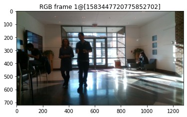
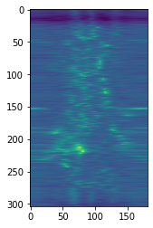
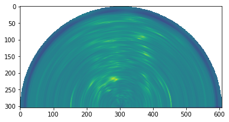

# RaDICaL Dataset SDK
> The RaDICaL Dataset: A synchronized and calibrated low-level Radar, RGB-D and IMU dataset.


[](https://www.youtube.com/watch?v=l0AyUw59w7g)

This is pre-alpha research quality code, and is being actively developed on.
Anything may change at anytime. Please check back here often.

Bug reports are very much appreciated.

# TODO

 - [ ] Radar config reader
 - [x] Read from aligned H5 dataset
 - [ ] Read from raw bags (to produce aligned/unaligned H5 datasets)
 - [x] Polar to Cartesian Projection
 - [ ] Camera/Radar coordinate transforms

## Install

`python -m pip install git+https://github.com/moodoki/radical_sdk.git`

## How to use
> Dataset is currently under review and will be made available soon.

Download the dataset at our [project page](https://publish.illinois.edu/radicaldata/).
A small sample to try things our can be found [here]().


Reading and displaying depth and RGB is easy

```python
#skip
import matplotlib.pyplot as plt
import numpy as np

from radicalsdk.h5dataset import H5DatasetLoader

data = H5DatasetLoader('../samples/indoor_sample.h5')


frame_idx = 1
plt.figure()
plt.imshow(data['rgb'][frame_idx])
plt.title(f'RGB frame {frame_idx}@{data["rgb_timestamp"][frame_idx]}')
plt.show()
plt.figure()
plt.imshow(data['depth'][frame_idx])
plt.title(f'Depth frame {frame_idx}@{data["depth_timestamp"][frame_idx]}')
plt.show()
```





The radar data is a 3D array arranged slow_time, antenna, fast_time.

`RadarFrame` encapsulates the necessary processing

```python
#skip

from radicalsdk.radar.config_v1 import read_radar_params
from radicalsdk.radar.v1 import RadarFrame

# Read config and configure RadarFrame object
radar_config = read_radar_params('../samples/indoor_human_rcs.cfg')
rf = RadarFrame(radar_config)

#Set raw cube to the required frame from the hdf5 file
rf.raw_cube = data['radar'][1]

# The desired view of the radar frame is now available
```

### Range Azimuth in Polar Coordinates

```python
# skip
plt.figure()
plt.imshow(np.log(np.abs(rf.range_azimuth_capon)))
plt.show()
```





### Projecting to cartesian

```python
#skip
from radicalsdk.geometry import PolarToCartesianWarp

p2c = PolarToCartesianWarp()

cartesian_radar = p2c(np.abs(rf.range_azimuth_capon)[np.newaxis, ..., np.newaxis])
plt.figure()
plt.imshow(np.log(cartesian_radar[0, ...]))
plt.show()
```

    /home/moodoki/.venvs/radical/lib/python3.8/site-packages/tensorflow_addons/utils/resource_loader.py:72: UserWarning: You are currently using TensorFlow 2.3.1 and trying to load a custom op (custom_ops/image/_resampler_ops.so).
    TensorFlow Addons has compiled its custom ops against TensorFlow 2.2.0, and there are no compatibility guarantees between the two versions. 
    This means that you might get segfaults when loading the custom op, or other kind of low-level errors.
     If you do, do not file an issue on Github. This is a known limitation.
    
    It might help you to fallback to pure Python ops with TF_ADDONS_PY_OPS . To do that, see https://github.com/tensorflow/addons#gpucpu-custom-ops 
    
    You can also change the TensorFlow version installed on your system. You would need a TensorFlow version equal to or above 2.2.0 and strictly below 2.3.0.
     Note that nightly versions of TensorFlow, as well as non-pip TensorFlow like `conda install tensorflow` or compiled from source are not supported.
    
    The last solution is to find the TensorFlow Addons version that has custom ops compatible with the TensorFlow installed on your system. To do that, refer to the readme: https://github.com/tensorflow/addons
      warnings.warn(
    <ipython-input-5-53e1d30792fa>:8: RuntimeWarning: divide by zero encountered in log
      plt.imshow(np.log(cartesian_radar[0, ...]))




